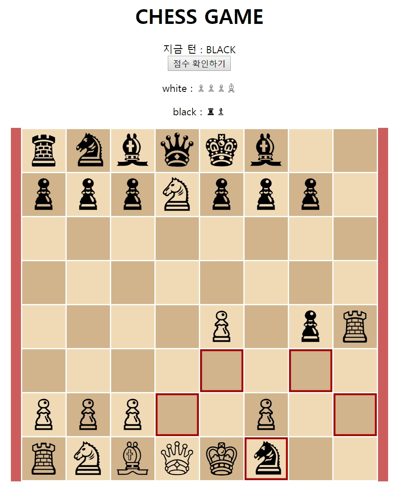

# CHESS



## 체스 규칙

- 흑부터 시작하며 번갈아가며 게임을 진행.
- King을 잡으면 게임 종료
- Pawn은 처음 움직일 때만 두 칸 직진할 수 있으며, 적이 있을 경우만 대각선으로 이동 가능
- 중간에 게임 종료시 동점일 경우 흑이 패배.
- 이전 게임이 종료되지 않았을 경우 게임을 이어서 진행.


## 이용 방법

* 현재의 턴을 확인하고 이동시킬 말을 클릭
* 현재 말이 갈 수 있는 위치가 표시
* 표시된 위치 중 하나를 선택해 이동
* 말을 다시 선택하고 싶을 경우 현재 말을 다시 클릭
* '점수 확인하기' 버튼 클릭 시 현재 점수들이 출력되며 게임이 종료됨 


## 실행 영상


# TODO LIST

**보드의 역할**
Board.class

```java

private Piece getPiece(Position source); // 특정 좌표의 말 식별

public void move(Position source, Position target); // 게임 진행 (보드는 말에게 받은 위치 리스트를 필터링 하여 최종적으로 갈 수 있는 위치리스트를 만듦)

```


**말의 역할**

Piece.class

```java
public boolean isAlive; // 죽었는지 살았는지
public abstract List<Position> movableList(Position source); // 갈 수 있는 좌표 반환
```

말은 보드에게 현재 위치를 받을 시 갈 수 있는 위치 리스트를 보드에게 넘겨줌

**좌표**

```java
class Position {
    int x;
	int y;
}
```

게임

```
체스 게임을 시작합니다.
> 게임 시작 : start
> 게임 종료 : end
> 게임 이동 : move b2 b3
```

​		